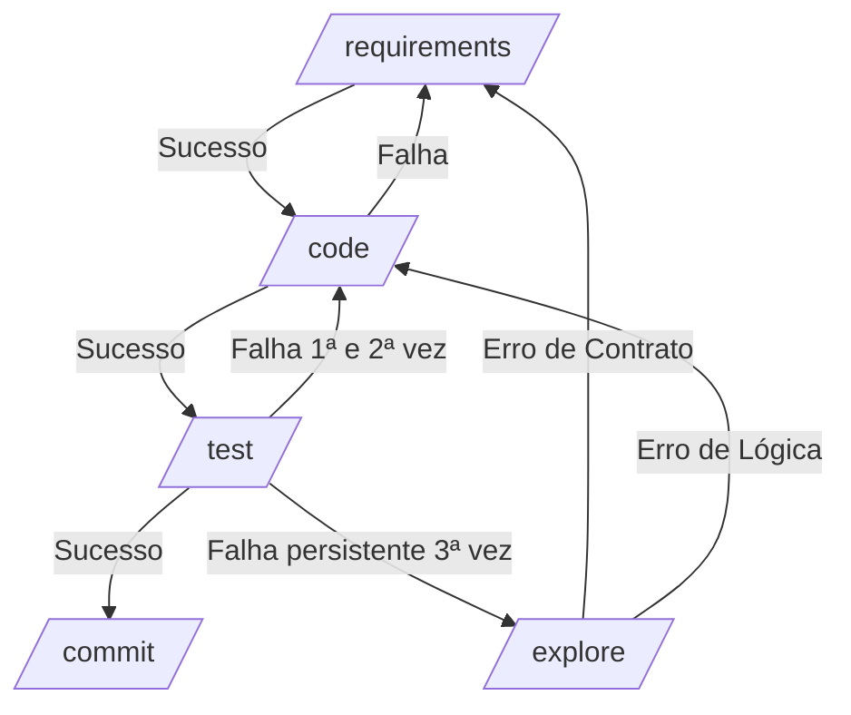

# Gerenciador de Workflows de Agentes

Este repositório contém a configuração e os scripts de gerenciamento de workflows orientados a papéis executados por agentes inteligentes. O fluxo sequencial de passagem de bastão garante consistência, qualidade e rastreabilidade no ciclo de desenvolvimento de software baseado no paradigma Design by Contract (Design por Contrato).

---

## Fluxo de Trabalho (Pipeline)

Ciclo de vida sequencial de passagem de bastão (handoff) dos agentes inteligentes:

---

## Workflows Disponíveis

### [Requirements](file:///d:/gen/.agents/workflows/requirements.md) (`/requirements`)
* **Objetivo:** Extrair a intenção do usuário, mapear regras de negócio binárias, projetar a arquitetura e interfaces do sistema.
* **Entregáveis:** Requisitos (`.docs/requirements/req_{timestamp}.md`) e design técnico (`.docs/design/design_{timestamp}.md`).
* **Próxima Etapa:** `/code` em caso de sucesso.

### [Code](file:///d:/gen/.agents/workflows/code.md) (`/code`)
* **Objetivo:** Implementar a lógica de negócios respeitando estritamente os contratos arquiteturais e interfaces sem alterar assinaturas.
* **Próxima Etapa:** `/test` em caso de sucesso.

### [Test](file:///d:/gen/.agents/workflows/test.md) (`/test`)
* **Objetivo:** Escrever cenários de teste unitário e de borda, garantindo cobertura mínima de 80% do código alterado.
* **Próxima Etapa:** `/commit` (sucesso) ou `/code --fix` (falha). Se falhar mais de duas vezes, aciona `/explore`.

### [Explore](file:///d:/gen/.agents/workflows/explore.md) (`/explore`)
* **Objetivo:** Realizar a análise de causa raiz (RCA) a partir de logs e apontar o direcionamento de rota para correção.
* **Roteamento:** `/requirements` (erros de contrato) ou `/code` (erros de lógica).

### [Commit](file:///d:/gen/.agents/workflows/commit.md) (`/commit`)
* **Objetivo:** Auditar a entrega em relação ao Definition of Done (DoD), agrupar as alterações e realizar o commit seguindo a convenção de Conventional Commits.

---

## Comandos e Uso

Invoque as rotas correspondentes no chat utilizando:
* `/requirements` - Análise de requisitos e design estrutural.
* `/code` - Implementação do código segundo o contrato.
* `/test` - Execução e validação de testes automatizados.
* `/explore` - Diagnóstico de causa raiz de erros técnicos.
* `/commit` - Consolidação da entrega e efetivação do commit.
